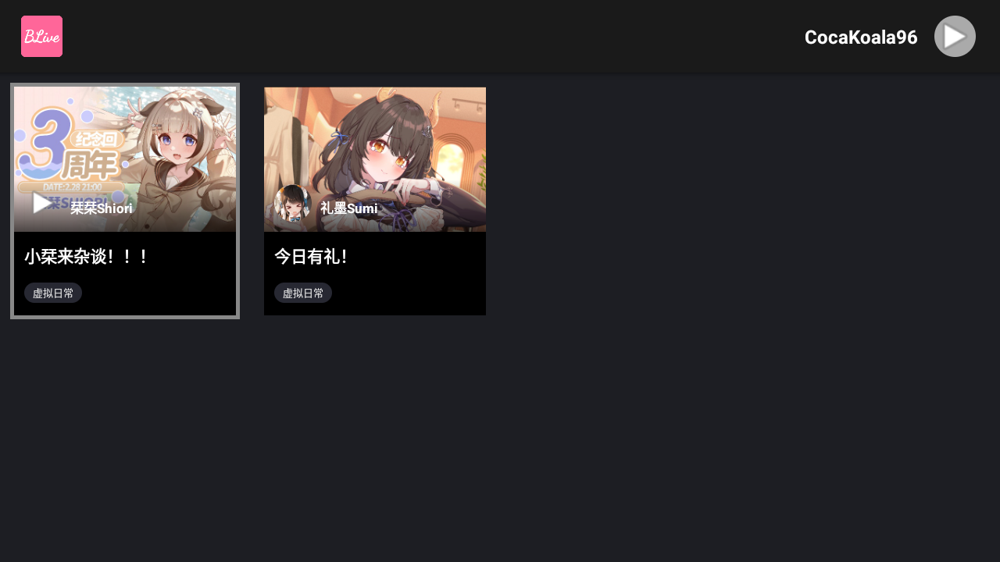
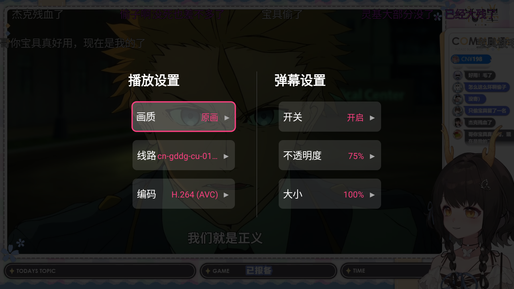
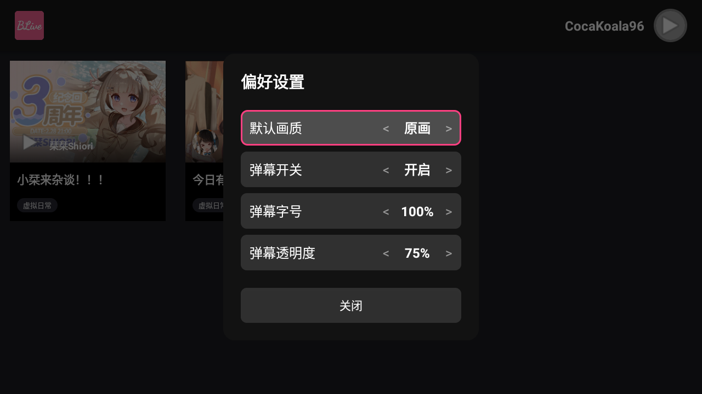

# BLive - Bilibili Live Client for Android TV (B站直播电视客户端)

**BLive** 是一款开源、无广告的 **第三方 Bilibili (B站) 直播客户端**，专为 **Android TV** 和 **电视盒子** 设计。

它基于 Google 官方的 **Leanback** 架构开发，遵循 Material Design 设计规范，为您提供流畅、纯净的大屏直播观看体验。支持 **4K/1080P 高清画质**、**实时弹幕**、**扫码登录** 以及 **遥控器完美适配**。

---

## ✨ 核心功能 (Features)

*   **📺 大屏沉浸体验**：专为 Android TV 适配的 UI 界面，支持遥控器焦点操作，流畅顺滑。
*   **🎥 高清画质**：支持 **4K**、**1080P**、**60FPS** 等多种清晰度原画播放（取决于直播间源）。
*   **💬 实时弹幕**：内置高性能弹幕引擎，支持弹幕大小、透明度、速度调节，支持屏蔽特定弹幕。
*   **📱 扫码登录**：支持 Bilibili 手机端扫码登录，同步您的关注列表和用户信息。
*   **⚡️ 硬解播放**：基于 **ExoPlayer**，支持 H.264/HEVC 硬件解码，低功耗更流畅。
*   **🛠 个性化设置**：画质偏好、弹幕设置、解码方式等均可自定义。

## 📸 界面预览 (Screenshots)

### 扫码登录

### 关注列表

### 播放界面

### 更多设置

### 用户偏好设置

## 📥 下载与安装 (Download)

请前往 [Releases 页面](../../releases) 下载最新版本的 APK 安装包。

1.  下载 `BLive-vX.X.X.apk` 到 U 盘。
2.  将 U 盘插入 Android TV 或电视盒子。
3.  通过文件管理器安装即可。

## 🛠 技术栈 (Tech Stack)

本项目采用现代 Android 开发技术栈构建：

*   **语言**：[Kotlin](https://kotlinlang.org/)
*   **架构**：MVVM
*   **UI 框架**：[Android Leanback](https://developer.android.com/jetpack/androidx/releases/leanback) (TV UI)
*   **网络请求**：[Retrofit](https://square.github.io/retrofit/) + [OkHttp](https://square.github.io/okhttp/)
*   **视频播放**：[ExoPlayer](https://github.com/google/ExoPlayer) (Media3)
*   **图片加载**：[Glide](https://github.com/bumptech/glide)
*   **弹幕引擎**：自定义 TCP/WebSocket 协议实现
*   **二维码**：[ZXing](https://github.com/zxing/zxing)

## 📚 开发文档

开发环境、构建运行、签名配置与 ADB 安装说明请查看：  
[开发文档](docs/development.md)

## 🎮 操作指南

*   **下方向键/菜单键 (播放页)**：呼出设置菜单。

## 🤝 贡献 (Contributing)

欢迎提交 Issue 和 Pull Request！

*   如果您发现了 Bug 或有新功能建议，请提交 [Issue](../../issues)。

## ⚠️ 免责声明 (Disclaimer)

1.  本项目仅供个人学习、研究和交流使用，请于下载后 24 小时内删除。
2.  本项目完全免费，**严禁用于任何商业用途或非法盈利**。
3.  本项目所使用的 API 接口均来源于 Bilibili 官方，其知识产权归 Bilibili 所有。本项目不保证 API 的稳定性、安全性及可用性。
4.  使用本项目所产生的任何后果由使用者自行承担，开发者不承担任何法律责任。
5.  如果本项目侵犯了您的权益，请联系开发者删除。

## 📄 许可证 (License)

本项目基于 [MIT License](LICENSE) 开源。
