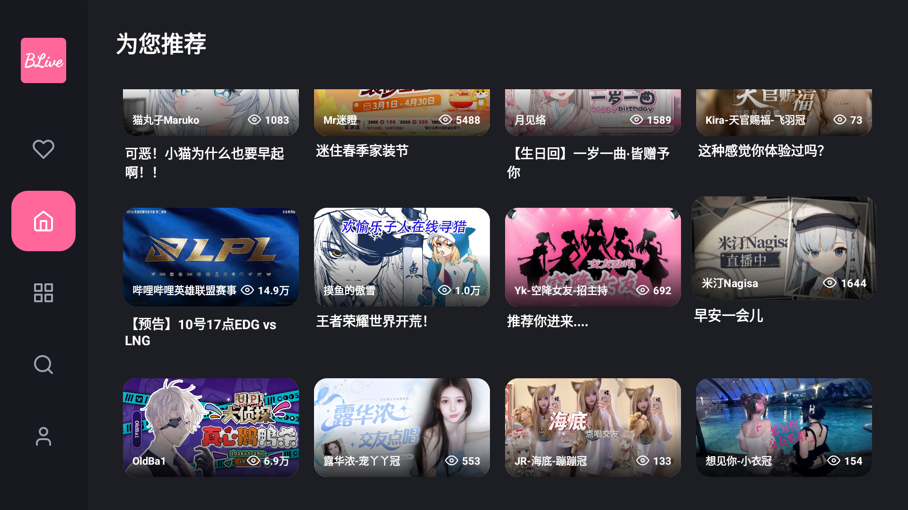
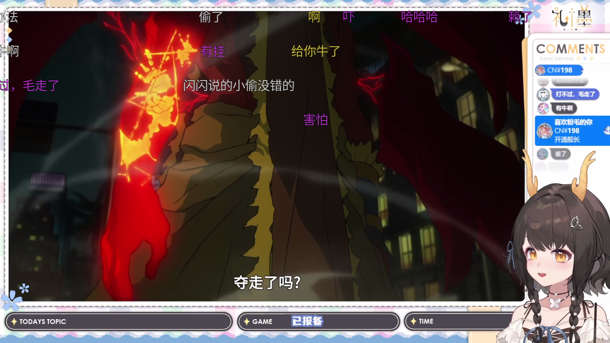
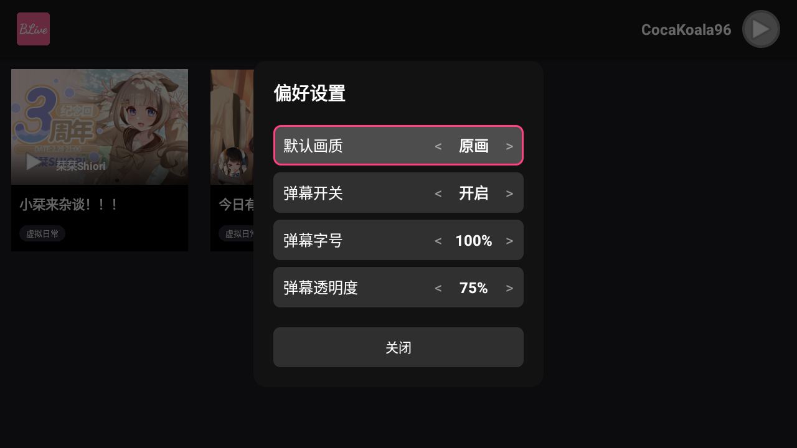

# BLive - 哔哩哔哩直播 TV 客户端

[](LICENSE)
[](https://kotlinlang.org/)
[](https://developer.android.com/tv)

**BLive** 是一款开源、无广告的第三方哔哩哔哩（B站）直播客户端，专为 **Android TV 与电视盒子** 设计，让你在客厅大屏上纯净地看直播。

> 🤖 **这是一个纯 Vibe Coding 项目**：本项目的所有代码（包括架构设计、UI 实现、业务逻辑等）均由 AI 辅助生成和重构。通过自然语言交互，实现了从需求到可运行应用的完整开发流程。

---

## ✨ 功能特性

- **📱 扫码登录**：使用 B站手机 App 扫码登录，同步关注列表与个人信息
- **🎬 直播浏览**：推荐直播间、关注主播直播、两级分区浏览、直播间搜索
- **🎥 高清播放**：多档清晰度、多 CDN 线路与编码格式可选，切换流畅不黑屏
- **💬 实时弹幕**：字号、透明度、速度、显示区域均可调节，断线自动重连
- **🎮 遥控器适配**：专为电视遥控设计的焦点交互，播放页内即可完成所有设置

## 📸 界面预览

### 扫码登录


### 推荐直播间列表


### 播放界面


### 用户偏好设置


## 📥 下载与安装

1. 前往 [Releases 页面](../../releases) 下载最新 APK。
2. 拷贝到 U 盘并插入电视 / 盒子，通过文件管理器安装；或使用 ADB：

   ```bash
   adb connect <电视IP地址>
   adb install -r BLive-release-vX.X.X.apk
   ```

3. 打开应用，扫码登录后即可使用全部功能。

## 🎮 遥控器操作指南

### 主界面
| 按键 | 功能 |
| --- | --- |
| 方向键 | 移动焦点、切换 Tab / 直播间卡片 |
| 菜单键 | 刷新当前列表 |
| 返回键 | 返回上一级；主界面双击退出应用 |

### 播放页
| 按键 | 功能 |
| --- | --- |
| 菜单键 / 下方向键 | 呼出播放设置面板（画质 / 线路 / 编码 / 弹幕） |
| 上方向键 / 确定键 | 显示房间信息浮层 |
| 长按确定键 | 关注 / 取关当前主播 |
| 返回键 | 关闭面板或浮层；双击退出直播间 |

## 🛠 技术栈

- **语言**：Kotlin，MVVM 架构
- **UI**：AndroidX Leanback
- **网络**：Retrofit + OkHttp
- **播放**：ExoPlayer
- **弹幕**：自研 TCP 弹幕协议客户端
- **其他**：Glide（图片加载）、ZXing（登录二维码）

## 🏗 从源码构建

```bash
./gradlew assembleDebug      # 构建 Debug 包
./gradlew assembleRelease    # 构建 Release 包（需先配置签名）
```

环境要求、签名配置与 ADB 安装说明详见 [开发文档](docs/development.md)。

## 🤝 贡献

欢迎提交 [Issue](../../issues) 与 Pull Request！

## ⚠️ 免责声明

1. 本项目仅供个人学习、研究和交流使用，请于下载后 24 小时内删除。
2. 本项目完全免费，**严禁用于任何商业用途或非法盈利**。
3. 本项目所使用的 API 接口均来源于哔哩哔哩官方，其知识产权归哔哩哔哩所有。本项目不保证 API 的稳定性、安全性及可用性。
4. 使用本项目所产生的任何后果由使用者自行承担，开发者不承担任何法律责任。
5. 如果本项目侵犯了您的权益，请联系开发者删除。

## 📄 许可证

本项目基于 [MIT License](LICENSE) 开源。
